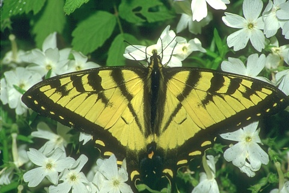

# Python Canny Edge Detector
Canny edge detection is an image processing method that uses a multi-stage algorithm to detect edges in an image while suppressing noice. 

# Canny Edge Detection Algorithm

## Overview of Steps
1)    Grayscale conversion - Convert an image from RGB to grayscale
2)    Noise Reduction - Apply Gaussian Filter to blur the image
3)    Gradient Calculation - Determine the gradient matrix.
4)    Non-Maximum Suppression - convert pixel magnitudes to a boolean as to whether the pixel is considered an edge or not
5)    Double Threshold - Compare the magnitudes of each edge pixel to two separate thresholds to determine if the edge has a large enough magnitude
6)    Edge Hysteresis -  Connect the weak edges to their strong neighbour.

Using this process we would be able to convert the following image conversions:
Original Image             |  Edge Map
:-------------------------:|:-------------------------:
  |  
  |  
  |  

## Step 1: Grayscale conversion
This algorithm is based on grayscale images. Therefore, the pre-requisite to begin the edge-detection is to convert the image from it's original RGB configuration to a grayscale image

## Step 2: Noise Reduction
The mathematics involved in this algorithm are mainly based on derivatives, this makes the results incredibly sensitive to image noise. One way to reduce noise is by applying a Gaussian blur to smooth the image. To blur the image, image convolution is applied using a Gaussian Kernel (see 5x5 Kernel below)

  

## Step 3: Gradient Calculation
The gradient calculation step detects the edge intensity and direction by calculating the gradient of the image.

Edges correspond to a change in pixel's intensity. To detect an edge, we apply filters that highlight the change in intensity in horizontal (x) and vertical (y) directions. This will calculate the image derivatives Ix and Iy. To obtain these values, we convolve the smoothed image previously calculated with the following kernels dx and dy.

  

The magnitude and direction of the graident are calculated as follows:
- Magnitude = SRSS(Ix, Iy) - SRSS means the Square root sum of squares
- Orientation = arctan2(Iy,Ix)

The orientation is the angle away from the positive x-axis in a clockwise manner, as follows:

  

## Step 4: Non-Maximum Suppression
The above step would provide some edges that are thick and some that are thin. This is a function of the size of the image in relation to the size of the Gaussian Kernel. The Non-Maximum Suppression step will help mitigate the thick areas.

Ideally, the final image should have thin edges, In order to achieve this, the algorithm goes through all the pixels on the gradient magnitude matrix and finds the pixels with a maximum value along the edge directions (found using the gradient orientation matrix)

This will return a boolean matrix (true/false for each pixel) which identifies which pixels are local maxima.

## Step 5: Double Threshold
The double threashold step aims at identifying 3 types of pixels:
- Strong pixels: Those which have an intensity so high that they definitely contibute to the final edge
- Weak pixels: Those which have an intensity not high enough to be considered strong, but also not small enough to be considered irrelevant
- Other pixels: Those with very low intensity, making them irrelevant to the edge

To group the pixels, we need to identify a high and low threshold value. Pixels that have been identified as potential edges in the above step are then compared to these two threshold values and grouped into their buckets. These values are determined using the maximum magnitude of pixels within the image and preselected high and low threshold ratios (0.15 and 0.4 respectively)

- High Threshold = max(Magnitude) * highThresholdRatio
- Low Threshold = High Threshold * lowThresholdRatio

## Step 6: Edge Hysteresis
The final step is to link the weak pixels to the strong ones using a concept known as Edge-Hysteresis. Comparing the Strong pixels to the weak ones, if the weak pixels are adjacent to a strong one along the direction of the edge, this process will then flag that weak pixel as an edge as well.

  

# More Output Examples
Original Image             |  Edge Map
:-------------------------:|:-------------------------:
  |  
  |  
  |  

